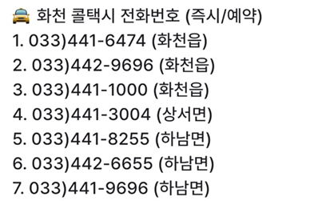

## < 사용법 >

## 이 버튼을 누르시고 원하시는 정보를 찾아 누르면 이동합니다.

# 📌 자주 묻는 질문 모음

---

## 📢 1. 군 복무 기간 및 진급

### ▪ 총 복무 기간
기본적으로 총 1년 6개월입니다.

### ▪ 진급
- 이병 + 병장: 총 6개월  
- 일병: 6개월  
- 상병: 6개월  

> 이병 기간이 짧으면 병장 기간이 더 길어집니다.  
> 특히 월의 마지막 주에 입대한 경우 병장 복무 기간이 길어질 수 있습니다.

---

## 📢 2. 7사단은?

### ▪ 동기제
- 3개월 단위 동기제  
- 예: 1-3월, 4-6월, 7-9월, 10-12월 입대자는 같은 동기입니다.

### ▪ 면회 / 외출 / 외박
- **면회:** 불가  
- **외출/외박:** 가능  
  - 분기 외박 1회  
  - 주말 외출 2회  
  - 월별 평일 외출 2회 *(부대마다 다를 수 있음)*  
  - 신청은 1~2주 전, 확정되면 취소나 변경은 드뭅니다.

> **분기 기준:** 1-3월 / 4-6월 / 7-9월 / 10-12월

### ▪ 위수지역
- 외출/외박 시 이동 가능한 범위로 **대부분 화천**입니다.  
- 특별한 사유 없이는 위수지역 외 이동은 불가능  
- **정확한 내용은 본인(남자친구)에게 확인하는 것이 가장 좋습니다.**  
- **휴가 시에는 위수지역 제한이 없습니다.**

### ▪ 생활관
- 최근엔 **동기 생활관**이 많지만  
  **GOP 등 특정 지역은 선임 생활관**이 기본  
- **침대 형태(2층/1층)**는 부대마다 다릅니다.

---

## 📢 3. 꾸나와 연락

### ▪ 훈련소 기간
- 주말/공휴일에도 연락이 안 오는 경우는 거의 없습니다.  
- 종교 활동 등으로 **연락이 늦게 오는 경우**도 있으니 차분히 기다려 주세요.

### ▪ 자대 배치 후

- **휴대폰 사용 가능 시간**  
  - 평일: 17:30 ~ 21:00  
  - 주말: 08:30 ~ 21:00  

> 위병소 근무, 식사, 청소, 오대기 등으로 인해 연락이 늦어질 수 있습니다.  
> 대개 **오후 6시 이후** 연락이 올 가능성이 높습니다.  
> **야간 훈련 시에는** 휴대폰 사용이 며칠간 제한될 수도 있습니다.

### ▪ 자대에서의 사용 환경
- 훈련소에 비해 원활하게 연락 가능  
- 초기에는 적응 중이라 **연락이 뜸할 수 있음**  
- 부대마다 통화 가능 환경이 다르며, **남자친구의 탓이 아니니 여유 있는 기다림이 필요합니다.**

---

## 📢 4. 편지 및 택배 관련

### ▪ 훈련소 주소
-강원도 화천군 화천읍 한묵령로 251 사서함 104-34호
7사단신병교육대대 0중대 소대 0번 000 훈련병

우편번호: 24108, 24109 (우편번호 두개 중 하나로 )

> 편지를 보내고 언제 꾸나가 받은지 모릅니다. ( `미배달` → `배달 준비` → `배달 완료` )

>  하지만 월요일 화요일에 간부님이 수거하셨다면 그 주에 받을 확률이 높아요.

### ▪ 준등기 VS 익특
- 개인적으로 보내는 속도가 두개 다 비슷해 싼 준등기 추천합니다.
- 200g이 넘으면 준등기 대신 익특으로 보낼수 있습니다. (익특은 무게별 금액측정)

### ▪ 꾸나가 보낸 편지
- 편지는 바로 보내지는 않으며, **일정량 모아 일괄 발송**됩니다.  
- 수령까지 **2~3주 정도** 소요될 수 있습니다.

> 훈련소 수령 시점은 랜덤이며 예측이 어려운 경우가 많습니다.  
> 예: 월요일 발송 → 다음 주에 수령될 수도 있음 (배송 또는 수거 지연)

### ▪ 택배 수령
- 자대에서 보낸 택배는 **부대 위병소 또는 화천우체국 군사우편출장소**에 도착  
- 이후 **간부님께서 수거**하여 부대 내로 옮깁니다.  
- 배송 상태 예시:  
  - `미배달` → `배달 준비` → `배달 완료`  
- 간부님이 수거 후 **당일 배부될 수도 있고 며칠 더 소요될 수도 있음**

---

## 📢 5. 기다리고 기다리던 휴가는 언제 나오나요?

### ▪ 휴가는 얼마나 받을 수 있나요?
- 휴가는 정말 **꾸나 하기 나름**입니다.  
- 초반에 열심히 하면 **분대장, 깍새 등 직책**을 받아 **추가 휴가**를 받을 수 있습니다.

### ▪ GOP 부대
- **외출 및 외박이 없는 대신** 휴가 일수가 일반 부대보다 많습니다.  
- 다만, **복무 환경은 다소 엄격**할 수 있습니다.

### ▪ 첫 휴가 (100일 휴가 / 신병 위로 휴가)
- 입대 후 **100일 전후에 나오는 경우**가 많습니다.  
- 기본적으로 **3박 4일** 휴가이며, **추가 휴가**를 붙일 수 있는지는 **부대마다 상이**합니다.
- 대부분 지오피, 지피는 휴가를 붙여서 나올수 있습니다.
- 부대 상황이 극단적이지 않은 이상 **신병 위로 휴가가 취소되는 경우는 매우 드뭅니다.**

### ▪ 만박과 찍턴 개념
- 만박은 14박 15일을 나오는 것을 말합니다. 한번 최대 사용 휴가일로 생각하시면 됩니다.
- 찍턴은 휴가 나왔다 다시 군대로 들어간후 바로 휴가를 다시 나오는 개념입니다.
  정말 찍고 나온다는 뜻입니다.
---

## 📢 6. 서울 → 화천 이동 방법

서울에서 화천으로 이동하는 대표적인 방법은 다음과 같습니다.

1. **용산역 → 춘천역 → 화천터미널**
2. **용산역 → 남춘천역 → 춘천터미널 → 화천터미널**
3. **동서울터미널 → 화천터미널**

### ▪ 소요 시간
- **춘천역 ↔ 화천터미널**: 약 40분 ~ 1시간  
- **춘천터미널 ↔ 화천터미널**: 약 40분 ~ 1시간

### ▪ 이용 팁
- **춘천터미널 → 춘천역** 이동 시 **버스 만차**인 경우가 있으므로  
  **시간이 촉박한 경우 2번 경로**를 추천합니다.
- **버스 승차**: 춘천역 → 화천터미널 방향은 **교통카드 사용 가능**  
  화천터미널 → 춘천역 방향은 **현장 예매 또는 티머니고 앱 예매** 필요

> 🚌 버스 시간표는 이미지 업로드 (화천->춘천)

---

## 📢 7. 외박 시 
### ▪ 주의사항 
- 군복을 필수 입니다. 사복은 안챙기셔도 됩니다.
- 위수지역 벗어나면 안됩니다.(점프금지)
- 외박은 당일 눈이 너무 많이오거나 심각한 상황아니면 당일 취소는 거의 없습니다.

### ▪ 위수지역
- 외출/외박 시 이동 가능한 범위로 **대부분 화천**입니다.  
- 특별한 사유 없이는 위수지역 외 이동은 불가능  
- **정확한 내용은 본인(남자친구)에게 확인하는 것이 가장 좋습니다.**  
- **휴가 시에는 위수지역 제한이 없습니다.**

### ▪ 숙소(펜션)
- 꾸나와 같이 쓸 펜션중 괜찮은 곳은 다음과 같습니다.

  - **라포렌**: [공식 사이트 바로가기](http://laforet98.com/contents/main.html) (개인적으로 여기 어여 예약 추천)
  - **비엔비**: [공식 사이트 바로가기](http://www.bnbhouse.co.kr/html/index.html)
  - **안녕하리** (블로그에서 예약 · 금방 꽉참): [공식 사이트 바로가기](https://www.hihari.co.kr/)
- 개인적으로 외박 신청시작일이 늦어 외박이 짤릴수 있습니다.
- 혹시 모를 수수료도 생각하시는걸 추천드립니다.

### ▪ 혼자 잘 모텔
- 대부분 하루전에 오셔서 자는 경우 모텔을 화천공영버스터미널 근처 모텔입니다.
  - **호텔아리**
  - **제이모텔**
- 둘다 전화로 예약하시면 됩니다. 
