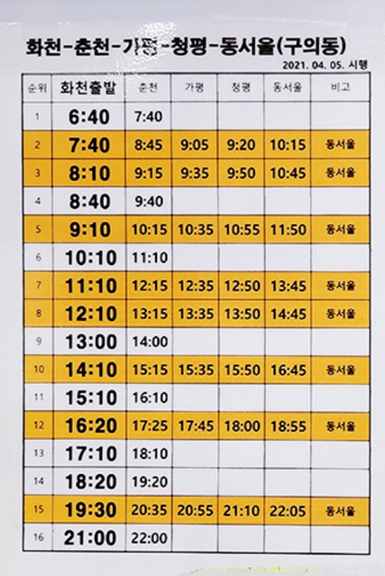

< 사용법 >

#### 원하시는 정보 클릭하면 됩니다

---

# 📌 자주 묻는 질문 모음 💌

---

## 📢 1. 군 복무 기간 및 진급 🪖

자세히 보기 👀

### ▪ 총 복무 기간
기본적으로 총 1년 6개월입니다.

### ▪ 진급
- 이병 + 병장: 총 6개월  
- 일병: 6개월  
- 상병: 6개월  

> 🐥 이병 기간이 짧으면 병장 기간이 더 길어집니다.  
> 특히 월의 마지막 주에 입대한 경우 병장 복무 기간이 길어질 수 있습니다.

---

## 📢 2. 7사단은? 🏞️

자세히 보기 💁‍♀️

### ▪ 동기제
- 3개월 단위 동기제  
- 예: 1-3월, 4-6월, 7-9월, 10-12월 입대자는 같은 동기입니다.

### ▪ 면회 / 외출 / 외박
- **면회:** ❌ 불가  
- **외출/외박:** 가능 🎉  
  - 분기 외박 1회  
  - 주말 외출 2회  
  - 월별 평일 외출 2회 *(부대마다 다를 수 있음)*  
  - 신청은 1~2주 전, 확정되면 취소나 변경은 드뭅니다.

> 📅 **분기 기준:** 1-3월 / 4-6월 / 7-9월 / 10-12월

### ▪ 위수지역
- 외출/외박 시 이동 가능한 범위로 **대부분 화천**입니다.  
- 특별한 사유 없이는 위수지역 외 이동은 불가능  
- **정확한 내용은 본인(남자친구)에게 확인하는 것이 가장 좋습니다.**  
- **휴가 시에는 위수지역 제한이 없습니다.**

### ▪ 생활관
- 최근엔 **동기 생활관**이 많지만  
  **GOP 등 특정 지역은 선임 생활관**이 기본  
- **침대 형태(2층/1층)**는 부대마다 다릅니다. 🛏️

---

## 📢 3. 꾸나와 연락 📱

자세히 보기 📞

### ▪ 훈련소 기간
- 주말/공휴일에도 연락이 안 오는 경우는 거의 없습니다.  
- ⛪ 종교 활동 등으로 **연락이 늦게 오는 경우**도 있으니 차분히 기다려 주세요. ⏳

### ▪ 자대 배치 후

- **휴대폰 사용 가능 시간**  
  - 평일: 17:30 ~ 21:00  
  - 주말: 08:30 ~ 21:00  

> 🧹 위병소 근무, 식사, 청소, 오대기 등으로 인해 연락이 늦어질 수 있습니다.  
> 대개 **오후 6시 이후** 연락이 올 가능성이 높습니다.  
> 🌙 **야간 훈련 시에는** 휴대폰 사용이 며칠간 제한될 수도 있습니다.

### ▪ 자대에서의 사용 환경
- 훈련소에 비해 원활하게 연락 가능  
- 초기에는 적응 중이라 **연락이 뜸할 수 있습니다.**  
- 부대마다 통화 가능 환경이 다르며, **남자친구의 탓이 아니니 여유 있는 기다림이 필요합니다.** 💗

---

## 📢 4. 편지 및 택배 ✉️📦

자세히 보기 ✍️

### ▪ 훈련소 주소
📬 강원도 화천군 화천읍 한묵령로 251 사서함 104-34호  
7사단신병교육대대 0중대 소대 0번 000 훈련병  
우편번호: 24108, 24109

> 📨 편지를 보내고 언제 꾸나가 받은지 모릅니다. (`미배달` → `배달 준비` → `배달 완료`)

> 😌 하지만 월요일 화요일에 간부님이 수거하셨다면 그 주에 받을 확률이 높아요.

### ▪ 준등기 VS 익특
- 개인적으로 속도는 비슷해요! 💸 **싼 준등기 추천**  
- 200g 넘으면 자동으로 익특으로 전환됩니다.

### ▪ 꾸나가 보낸 편지
- 편지는 바로 발송되지 않으며 **모아 발송**, 수령까지 2~3주 소요  

> 📅 수령 시점은 랜덤이며 예측 불가해요!

### ▪ 택배 수령
- 📦 위병소 또는 화천우체국 군사우편출장소 도착 → 간부님 수거 → 부대 배부  
> 상태 예: `미배달` → `배달 준비` → `배달 완료`

---

## 📢 5. 기다리고 기다리던 휴가 🏖️

자세히 보기 🌈

### ▪ 휴가는 얼마나 받을 수 있나요?
- 휴가는 정말 **꾸나 하기 나름**입니다.  
- 열심히 하면 **분대장, 깍새 등 직책**으로 **추가 휴가 가능!** 🏆

### ▪ GOP 부대
- 외출/외박 ❌ → 대신 **휴가 일수 많음**

### ▪ 첫 휴가 (100일 휴가 / 신병 위로 휴가)
- 💯 입대 후 100일 전후  
- **3박 4일 기본**, 붙여서 나올 수도 있어요  
- ❗ 취소는 극히 드물어요

### ▪ 만박과 찍턴 개념
- **만박**: 14박 15일 (최장)  
- **찍턴**: 복귀했다가 바로 또 나오는 휴가 💨

---

## 📢 6. 서울 → 화천 이동 🚉🚌

자세히 보기 🧭

### ▪ 주요 경로
1. 용산역 → 춘천역 → 화천터미널  
2. 용산역 → 남춘천역 → 춘천터미널 → 화천터미널  
3. 동서울터미널 → 화천터미널

### ▪ 소요 시간
- 춘천 ↔ 화천: 약 40분~1시간 🕐

### ▪ 이용 팁
- 버스 만차 대비 **시간 여유 필요**  
- 티머니고 앱으로 미리 예매 가능 🎫

> 🚌 버스 시간표는 이미지 업로드 어려우니 채팅방에 물어보세요!

---

## 📢 7. 외박 시 주의사항 🏠

자세히 보기 🛏️

### ▪ 주의사항
- 군복 필수! 사복 안 챙겨도 돼요  
- 눈 오는 날 외엔 취소 거의 없음  
- 위수지역 **절대 벗어나면 안 돼요!** ⛔

### ▪ 숙소 (펜션)
- 추천:  
  - 🏡 **라포렌**: [예약하기](http://laforet98.com/contents/main.html)  
  - 🌲 **비엔비**: [예약하기](http://www.bnbhouse.co.kr/html/index.html)  
  - 🍀 **안녕하리**: [예약하기](https://www.hihari.co.kr/)

> 외박 신청 타이밍 놓치면 짤릴 수도 있어요 😢  
> 수수료도 미리 확인해보세요!

### ▪ 혼자 잘 모텔
- 추천 모텔:  
  - **호텔아리** 🛎️  
  - **제이모텔** 💤  
→ 전화 예약하시면 됩니다 📞

